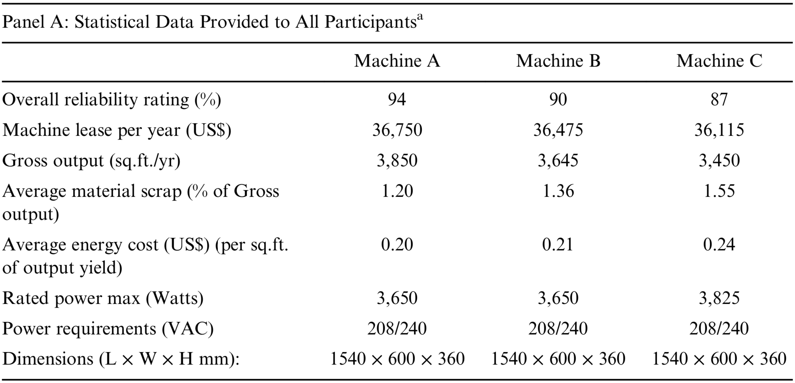
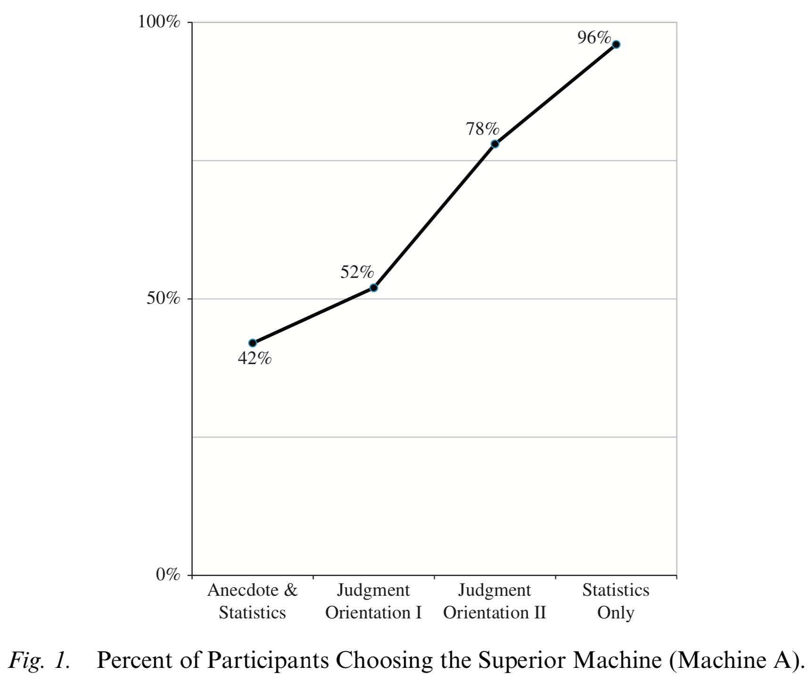
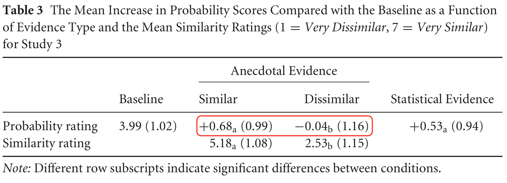

```{r setup, include=FALSE}
library(knitr)
library(targets)
library(magick)
library(RefManageR)

options(htmltools.dir.version = FALSE)

opts_chunk$set(
  echo = FALSE,
  warning = FALSE,
  message = FALSE,
  fig.width = 6,
  fig.asp = 0.618,
  fig.retina = 3,
  out.width = "70%",
  fig.align = "center"
)

plot_anecdotes_2 <- anecdotes2::get_plot(anecdotes2::data)
materials_anecdotes_2 <- system.file("materials", package = "anecdotes2")

bib <- ReadBib("references.bib")

BibOptions(
    check.entries = FALSE,
    bib.style = "authoryear",
    cite.style = "authoryear",
    style = "markdown",
    hyperlink = FALSE,
    dashed = FALSE
)
```

# Anecdotal Bias

- Preference of anecdotal over statistical evidence

--

- Tested using statistics only vs. anecdote & statistics conditions

???

- The finding that people prefer anecdotal over statistical evidence
- Usually has medical content
  - That is, "data shows this treatment is 80% effective, but here's a story
    about someone that it didn't work for"
- Tested by comparing a condition with only statistics and a condition with both
  an anecdote and statistics.
  - Anecdotal bias is seen when people are less likely to say they'll use the
    treatment in the combined condition than when only seeing the statistics.
  
---

# Anecdotal Bias in Business

???

- This has typically been investigated in a medical context, but this kind of bias may be an issue in business settings because of the focus on case studies in business schools. Also, there has been a trend over the last few decades for firms to diversify, so when informing their decision-making they are more likely to look for examples outside the firm, as opposed to examples within the firm. 

---

# Anecdotal Bias in Business

```{r wainberg2018-statistics}

```

.footnote[

`r Citep(bib, "wainberg2018")`

]

???

- In an email message, an colleague described having had a bad experience with
  the top-rated Machine A and stated how she "could not recommend it as a wise
  choice."

---

# Anecdotal Bias in Business

```{r wainberg2018-results, out.width = "55%"}

```

.footnote[

`r Citep(bib, "wainberg2018")`

]

???

- If the anecdote makes the target project look bad, anecdotal bias is seen when
  people allocate less to the combined condition 

---

# Effect of Similarity

???

- Some results show that people are more persuaded by similar rather than
  dissimilar anecdotes.

--

> **Diner** 'het Hommeltje' in Heerlen is a successful diner where you can eat well
> at low prices. However, customers do not order many drinks. Extending the wine
> list at 'het Hommeltje' in Heerlen is a good option to increase the drinks
> turnover.

.footnote[

`r Citep(bib, "hoeken2009")`

]

--

.pull-left[

### High Similarity

> For in **diner** 'Den dikken dragonder' in Kerkrade, which aims at a similar
> clientele, extending the wine list has led to sharp increase in the drinks
> turnover.

]

--

### Low Similarity

.pull-right[

> For in **top restaurant** Da Vinci in Maasbracht, proud owner of a Michelin star,
> extending the wine list has led to a sharp increase in the turnover of drinks.

]

???

- "Sixteen claims on different specific cases were developed, for instance, the
  claim that extending the wine list would lead to more customers buying drinks
  in a diner in a midsized town in the southern part of the Netherlands"
- "After each short text, the claim was repeated and participants had to
  indicate how likely they regarded the consequence to occur on a 7-point scale
  ranging from 'very unlikely' to 'very likely.'"
  
---

# Effect of Similarity

```{r hoeken2009, out.width = "80%"}

```

.footnote[

`r Citep(bib, "hoeken2009")`

]

---

name: experiment

class: center, middle

# The Experiment

---

## Research Questions

- Would the similarity of an anecdote affect anecdotal bias?

--

- Would this depend on anecdote valence?

---

## Design

- Evidence type

  - Anecdote & statistics
  - Statistics only

--

- Anecdote similarity
  - Low
  - High

--

- Anecdote valence
  - Negative
  - Positive

--

- N = 48
  - Sample: Prolific
  - Within-subjects

---

```{r project-allocation-anecdote-valence-negative-similarity-low-materials-anecdotes-2, out.width = "60%"}
file.path(
  materials_anecdotes_2,
  "project_allocation_anecdote_valence_negative_similarity_low.png"
) %>%
  image_read() %>%
  image_trim()
```

???

- Participants were shown two focal projects
- The target project was made to be either similar or dissimilar to the anecdote
- I measured allocation to the target

- An example of the anecdote display in the negative valence, low similarity
condition of Experiment 2.

---


```{r project-allocation-target-valence-negative-similarity-low-materials-anecdotes-2, out.width = "50%"}
file.path(
  materials_anecdotes_2,
  "project_allocation_target_valence_negative_similarity_low.png"
) %>%
  image_read() %>%
  image_trim()
```

???

An example of the focal projects in the negative valence, low similarity
condition of Experiment 2. Here, Project 1 was the target project and Project 2
was the comparison project.

---

```{r project-allocation-anecdote-valence-positive-similarity-high-materials-anecdotes-2, out.width = "60%"}
file.path(
  materials_anecdotes_2,
  "project_allocation_anecdote_valence_positive_similarity_high.png"
) %>%
  image_read() %>%
  image_trim()
```

???


An example of an anecdote display in the positive valence, high similarity
condition of Experiment 2.

---

```{r project-allocation-target-valence-positive-similarity-high-materials-anecdotes-2, out.width = "46%"}
file.path(
  materials_anecdotes_2,
  "project_allocation_target_valence_positive_similarity_high.png"
) %>%
  image_read() %>%
  image_trim()
```

???

An example of the focal projects in the positive valence, high similarity
condition of Experiment 2. Here, Project 2 was the target project and Project 1
was the comparison project.

---

## Instructions

--

- Statistics: aggregated data from thousands of other projects

--

- Anecdote: randomly sampled

  - All anecdotes in the pool were equally similar to the target project

  - A part of aggregated data

---

## Hypotheses

--

### Negative Valence

.pull-left[

#### High Similarity

- Statistics only > anecdote & statistics 
  - Positive difference score

]

.pull-right[

#### Low Similarity

- Statistics only = anecdote & statistics 

]

--

### Positive Valence

.pull-left[

#### High Similarity

- Statistics only < anecdote & statistics 
  - Negative difference score
 
]

.pull-right[

#### Low Similarity

- Statistics only = anecdote & statistics 

]

---

name: results

class: center, middle

# Results

---

```{r anecdotes-2-allocation-difference, out.width = "98%", fig.width = 8}
plot_anecdotes_2$allocation_difference
```

---

name: conclusion

class: center, middle

# Conclusion

---

## Summary

--

- Evidence for anecdotal bias

--

- Depends on anecdote similarity

--

- Both in negative and positive anecdotes

---

## Theoretical Implications


- People are sensitive to underlying relevance

--

- People ignore sample distribution information

--

## Practical Implications

- If reference data available:

  - Consider distribution of similarity across sample

--

- If reference data unavailable:

  - Consider structural similarity of anecdote to target

---

## Next steps

- Replicate with managers

???

- This work was with lay people, but we are planning on replicating this work but with managers of real
  businesses.

--

- Decision aids

???

- We are also interested in testing various ways of helping people understand sample distribution and anecdote relevance.

---

class: inverse, center, middle

# Thank you

???

- Thank you for listening.

---

## References

.small[

```{r references, results="asis"}
PrintBibliography(bib)
```

]
